# HEAR

<p align="center">
  <strong>Towards the Vision-Sound-Language-Action Paradigm:</strong><br>
  <strong>The HEAR Framework for Sound-Centric Manipulation</strong>
</p>

<p align="center">
  Chang Nie, Tianchen Deng, Guangming Wang, Zhe Liu, Hesheng Wang
</p>

<p align="center">
  Shanghai Jiao Tong University, University of Cambridge
</p>

<p align="center">
  <a href="https://hear.irmv.top">Project Page</a>
  |
  <a href="https://hear.irmv.top/#videos">Video Demos</a>
  |
  <strong>Paper:</strong> Coming soon
  |
  <a href="https://github.com/IRMVLab/HEAR">Code</a>
</p>

<p align="center">
  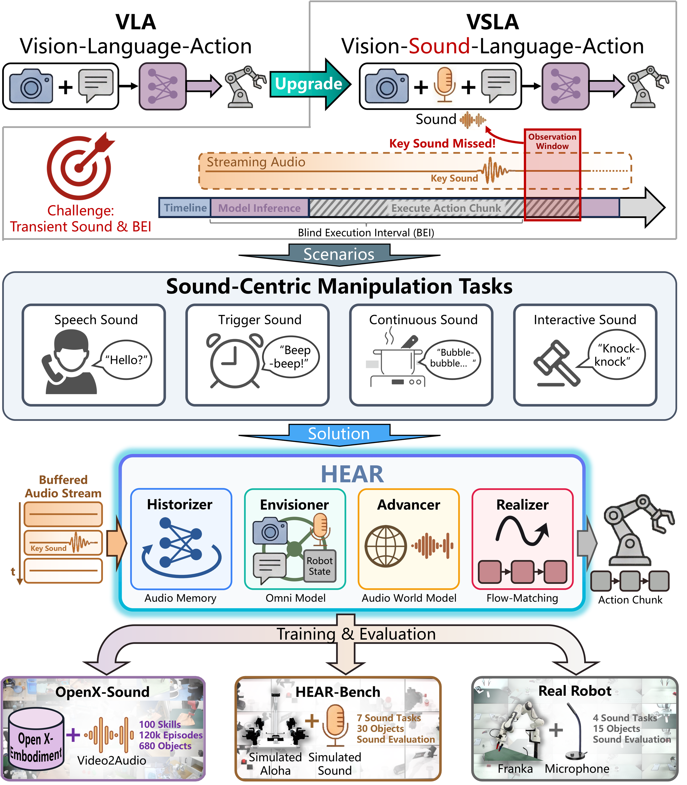
</p>

> HEAR upgrades conventional VLA into a Vision-Sound-Language-Action (VSLA) setting, where a robot must see, hear, remember, and react under delayed, chunked control.

## Overview

Modern VLA policies work well when the key evidence is visually persistent. In sound-centric manipulation, however, the crucial signal may be a short beep, a collision click, the prosody of spoken feedback, or the gradual evolution of a process sound. These cues are often brief, non-repeatable, and easy to miss during open-loop chunk execution.

This work formalizes the **Vision-Sound-Language-Action (VSLA)** paradigm and introduces **HEAR**, an end-to-end framework for sound-causal robot manipulation. HEAR is designed around two core problems:

- **Blind Execution Interval (BEI):** brief audio cues can occur and vanish between policy queries.
- **Temporal grounding:** during long waiting phases with quasi-static vision, the policy still needs to understand how the task is progressing over time.

To address these issues, HEAR combines causal audio memory, multimodal reasoning, future-audio prediction, and smooth action chunk generation.

## What This Work Does

HEAR contributes four pieces together rather than adding audio as a simple extra input:

1. **VSLA paradigm.** We formalize robot control conditioned on multi-view vision, streaming audio, language, and proprioception under delayed decision loops.
2. **HEAR framework.** We introduce a four-part architecture for preserving transient acoustic evidence and grounding long-horizon control in sound.
3. **OpenX-Sound.** We build an audio-augmented pretraining resource from Open X-Embodiment for scalable multisensory pretraining.
4. **HEAR-Bench.** We build the first benchmark explicitly designed for sound-causal manipulation, where visually plausible but acoustically premature actions are counted as failures.

## Framework

<p align="center">
  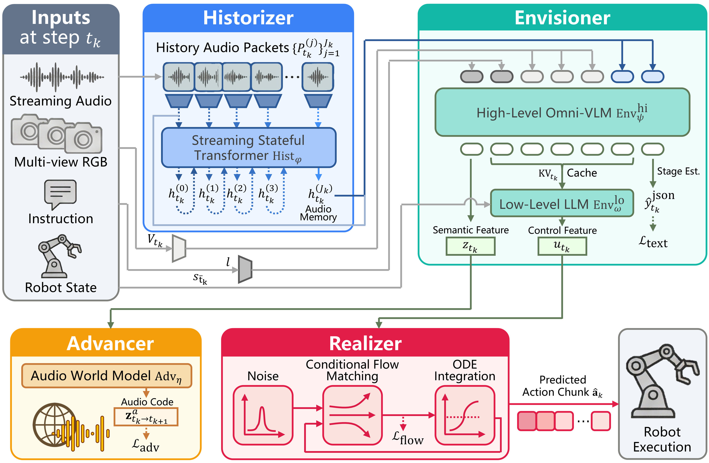
</p>

HEAR decouples high-frequency auditory sensing from low-frequency decision making:

- **Historizer** keeps a compact causal memory of recent audio packets, so fleeting cues remain available at the next decision.
- **Envisioner** fuses vision, language, proprioception, the current audio window, and the Historizer memory into control-ready multimodal representations.
- **Advancer** predicts near-future audio codes during training, injecting temporal structure into the shared latent space.
- **Realizer** generates smooth action chunks with conditional flow matching, reducing motion jitter and mechanical ego-noise.

<table>
  <tr>
    <td align="center">
      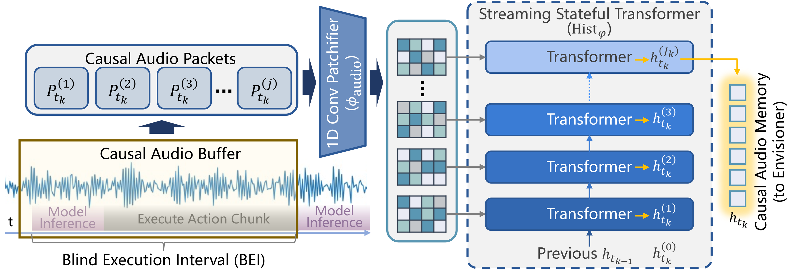<br>
      <strong>Historizer</strong><br>
      Streaming causal audio memory that bridges execution gaps.
    </td>
  </tr>
  <tr>
    <td align="center">
      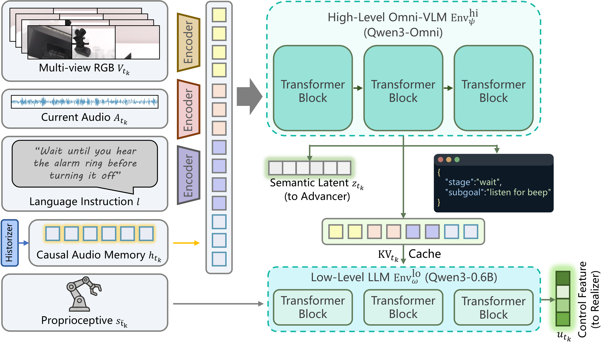<br>
      <strong>Envisioner</strong><br>
      Hierarchical multimodal reasoner for semantic understanding and control features.
    </td>
  </tr>
  <tr>
    <td align="center">
      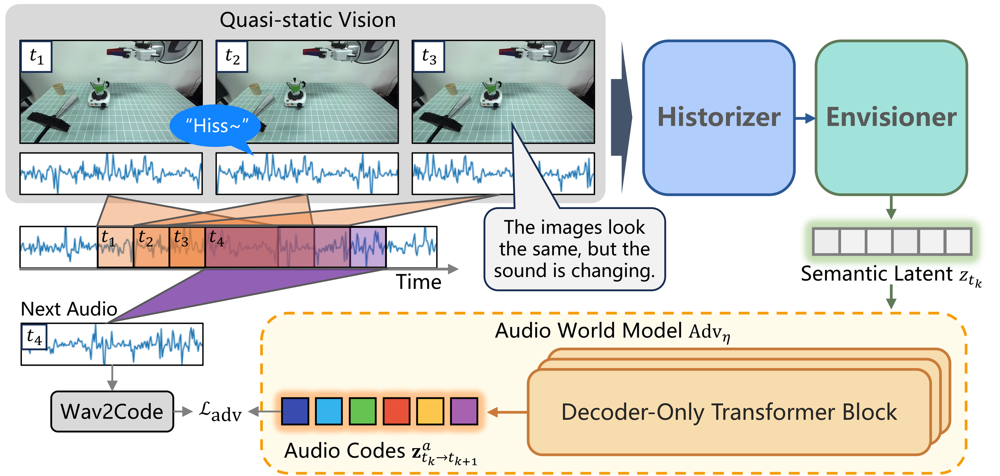<br>
      <strong>Advancer</strong><br>
      Audio world model for near-future prediction and temporal grounding.
    </td>
  </tr>
</table>

## OpenX-Sound and HEAR-Bench

HEAR is supported by both training data and evaluation infrastructure:

- **OpenX-Sound** augments selected Open X-Embodiment trajectories with synchronized audio for large-scale pretraining.
- **HEAR-Bench** evaluates seven simulation tasks under strict sound-causal rules across four acoustic cue types: event-triggered alarms, human speech and prosody, continuous process sounds, and physical interaction feedback.

In the paper, OpenX-Sound is manually audited with **98.7% synchronization accuracy within 100 ms tolerance**, and HEAR-Bench is designed so that acting before the required cue is always counted as failure.

## HEAR-Bench Tasks

### Simulation Tasks

<table>
  <tr>
    <td align="center" width="50%">
      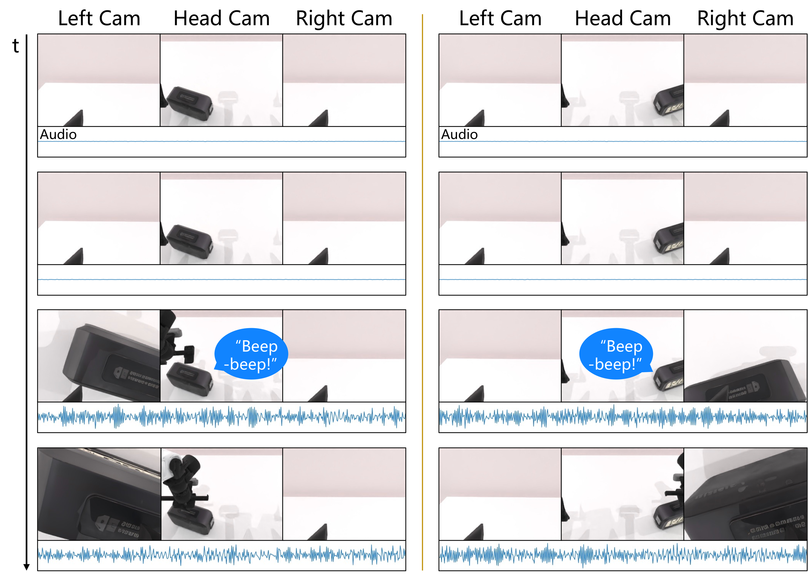<br>
      <strong>Alarm Clock</strong><br>
      Wait for a sustained trigger and press only after ring onset.
    </td>
    <td align="center" width="50%">
      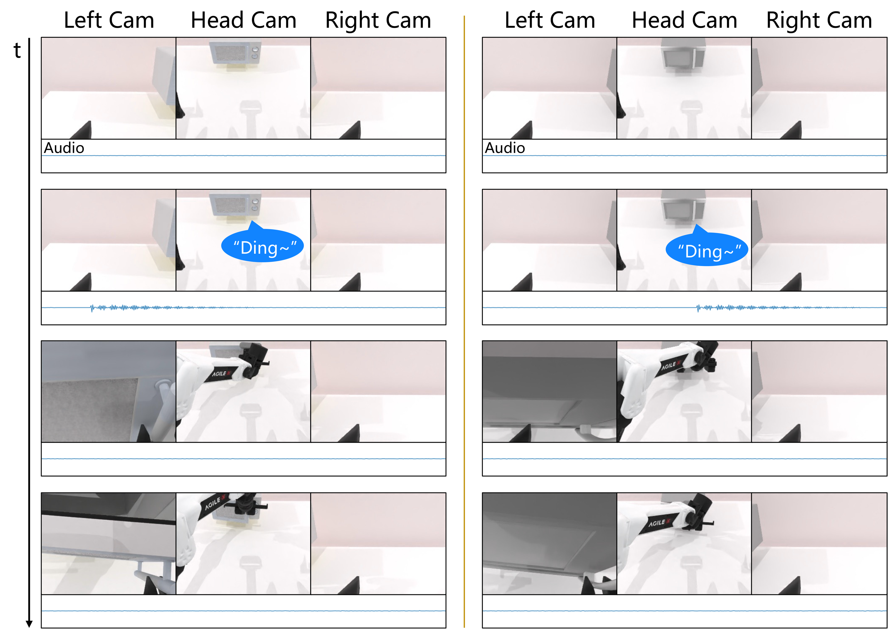<br>
      <strong>Microwave</strong><br>
      React to a short ding that may vanish during chunked execution.
    </td>
  </tr>
  <tr>
    <td align="center" width="50%">
      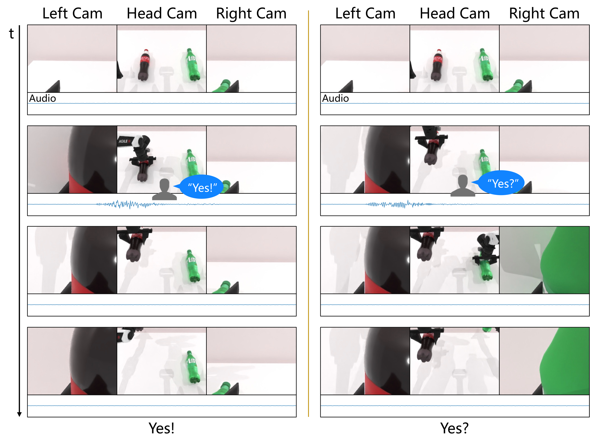<br>
      <strong>Check Yes</strong><br>
      Use prosody rather than transcript text to decide whether to switch objects.
    </td>
    <td align="center" width="50%">
      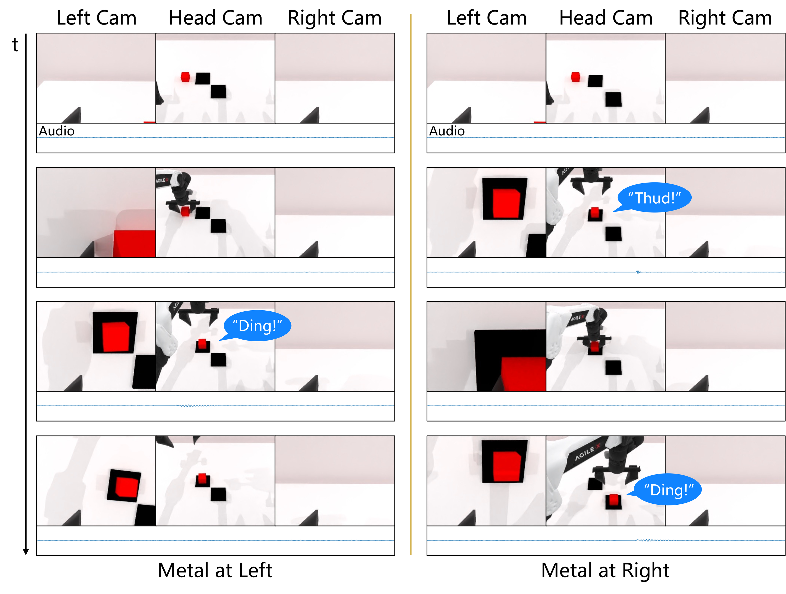<br>
      <strong>Check Materials</strong><br>
      Infer material properties from impact acoustics.
    </td>
  </tr>
  <tr>
    <td align="center" width="50%">
      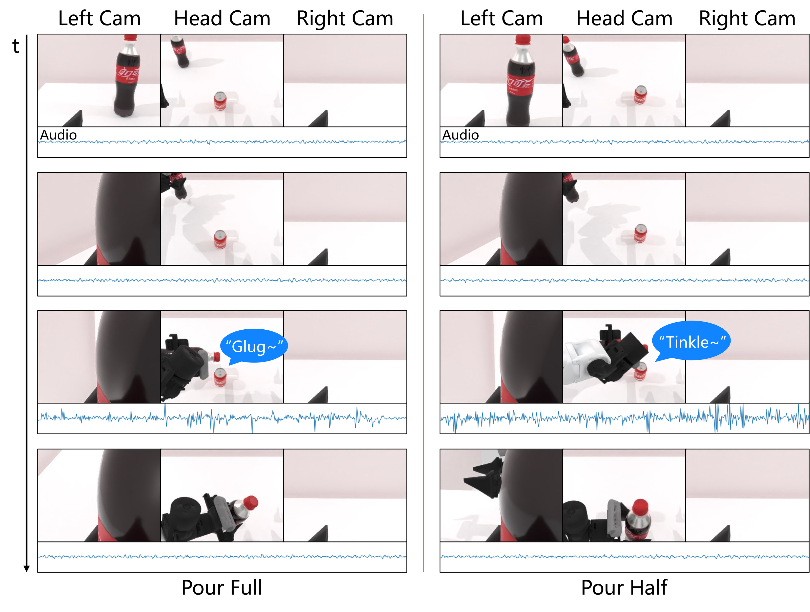<br>
      <strong>Pour Water</strong><br>
      Monitor continuous pouring sound to stop at the right target level.
    </td>
    <td align="center" width="50%">
      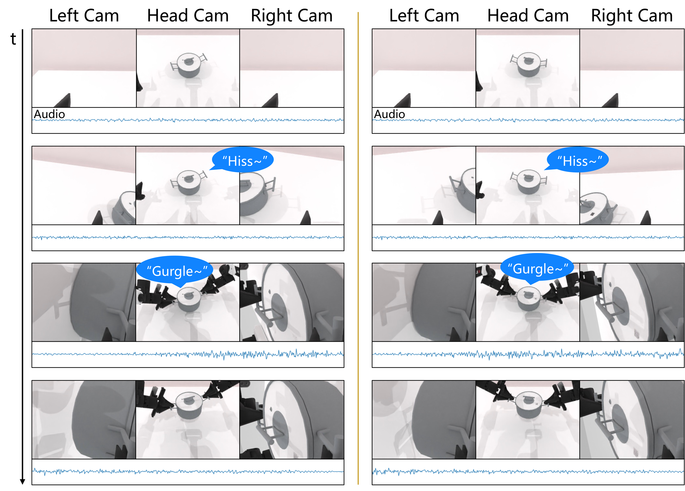<br>
      <strong>Boil Water</strong><br>
      Wait through a long static scene and react to the acoustic transition to rolling boil.
    </td>
  </tr>
  <tr>
    <td align="center" width="50%">
      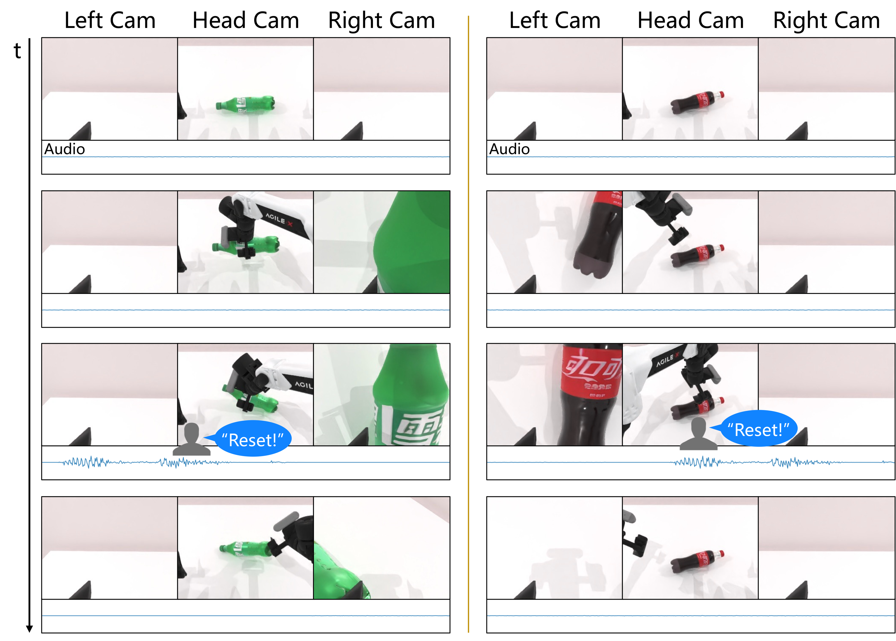<br>
      <strong>Interrupt</strong><br>
      Safely override an ongoing routine after a spoken reset command.
    </td>
    <td align="center" width="50%"></td>
  </tr>
</table>

### Real-Robot Tasks

<table>
  <tr>
    <td align="center" width="50%">
      <br>
      <strong>Moka Coffee</strong><br>
      Long-horizon process monitoring from subtle brewing acoustics.
    </td>
    <td align="center" width="50%">
      <br>
      <strong>Answer Phone</strong><br>
      Multi-stage task with ringtone detection, speech understanding, and end-of-call recognition.
    </td>
  </tr>
  <tr>
    <td align="center" width="50%">
      <br>
      <strong>Shake Bottle</strong><br>
      Active acoustic sensing through self-generated shaking motion.
    </td>
    <td align="center" width="50%">
      <br>
      <strong>Real Alarm Clock</strong><br>
      Robust waiting under real-world reverberation and background noise.
    </td>
  </tr>
</table>

More qualitative demos are available on the [project page](https://hear.irmv.top/#videos).

## Repository Status

This repository is currently being prepared for public release.

## Citation

If you find this project useful, please consider citing:

```bibtex
@article{nie2026hear,
  title   = {Towards the Vision-Sound-Language-Action Paradigm: The HEAR Framework for Sound-Centric Manipulation},
  author  = {Nie, Chang and Deng, Tianchen and Wang, Guangming and Liu, Zhe and Wang, Hesheng},
  year    = {2026},
  note    = {Under review}
}
```
